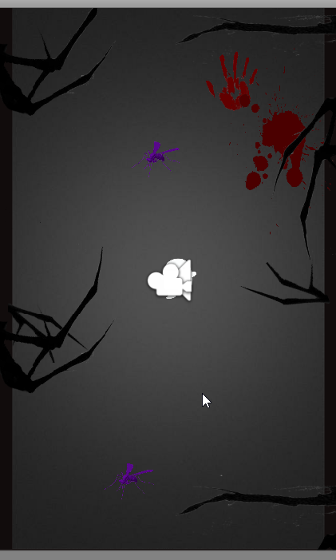

# TheGhost

课程作业-恐惧关卡游戏

*****************

**游戏世界观：**

捐去三纲五常，绝去七情六欲，费其半菽，如失金珠，拔其一毛，有关痛痒。 ★清·钱泳《履园丛话·臆论·五福》

所谓七情，常指喜、怒、忧、思、悲、恐、惊。

精灵来到这世间，便要经历这七情六欲，只有不断的通关，才能获得心灵的升华，灵魂的淬炼。

一如人行走于世界，常受制于三纲五常，七情六欲。有人受困于此，有人泰然处之，有人奋起挣扎，有人漠然淡化。

无论何种姿态，及至到达终点，回头瞭望时，终能有所领会。

恐，在笔者看来，乃负面情绪之最。

人恒有期待，有期待，便会惧怕期待落空，由此心生焦虑、愤怒、悲凉，落寞。凡此种种，皆源自于恐。

恐，也是正面情绪的催生剂。

有恐，才会遵守规则，不断鞭策，努力求生。

精灵所要做的，就是正视恐惧，穿越黑暗。毕竟，黑暗的尽头，就是光明...

After all, where there is darkness, there is light.

******************

**游戏玩法：**

2d、竖版、左右移动躲避障碍物

******************

**游戏美术：**

暂无美术，所以界面很丑很简陋，全是网上找到的 = =(等我学会画画！

******************

**unity版本：**
20183.0 - > 2018.3.1

******************

**总结：**

做的比较简单，暂且搁浅了，去搬策划、美术、程序分工比较细的砖了···

一个人太难了 - -

